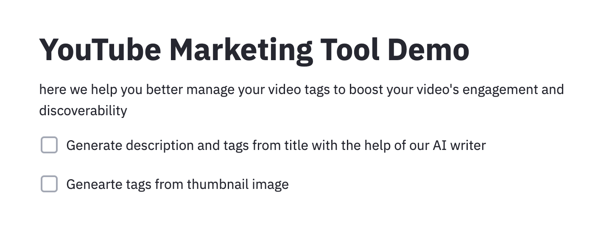

# YouTube-marketing-tool
 Leverage the power of NLP and NLP to make writing YouTube description and tags eaiser


### Structure of the repo
The repo is organised in three components
1. Streamlit app which is the YouTube marketing tool demo you see in the picture above
1. Language model which fintunes a GPT2 model from transformers library provided by Huggingface
1. Category classifier model which contains a distilbert from a library called ktrain built on top of tensorflow

### Original dataset
The original dataset is from https://www.kaggle.com/datasnaek/youtube-new with trending videos from 6 different countries from mid 2017 to 2018 and this repo uses the data from three English speaking countries: (US, UK and Canada).

### Saved models
The data are all in the relevent file but the saved model files are too big to upload to github
TODO:
* upload finetuned gpt model to the huggingface model card so can be pulled from Amazon S3 (I keep getting bad requests when I am trying to do this)
* upload the tensorflow model file also to a public accessible s3 bucket so it can be accessed
* upload the strealit app to Heroku so it is publicly accessible (after the two model files are both hosted on the cloud)

The trainings are done in Google Colab free GPU.

### Usage
to run the repo, fist install all the dependencies
```python
pip install -r requirements.txt
```
Run the ipynb files in the *language_model* *category_classifier* folders respectively to train the models.

To launch the streamlit app, make sure you are in './app' directory and then:
```python
streamlit run app.py
```

You should see the streamlit app up and running!